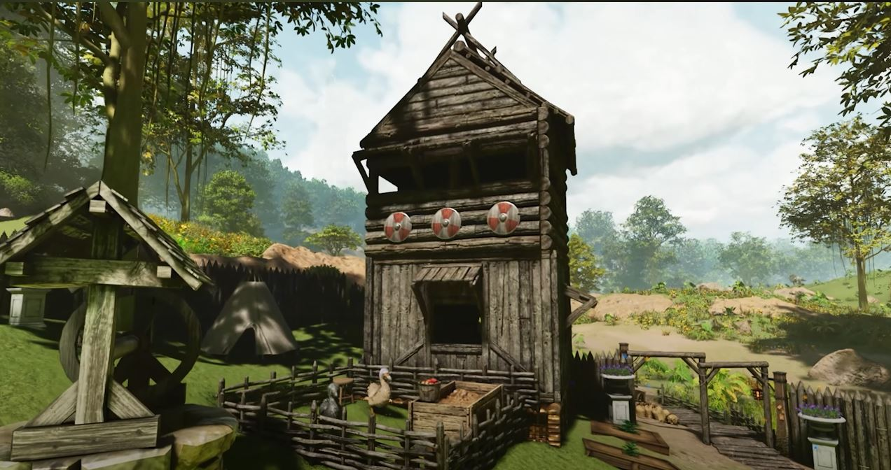
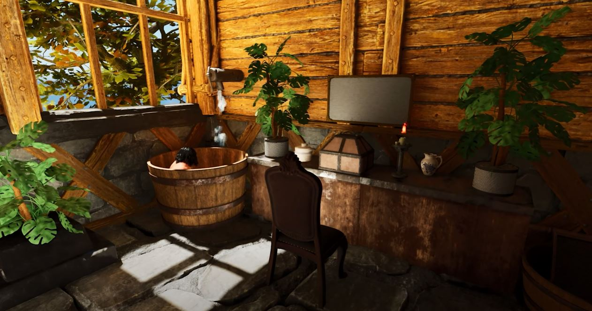
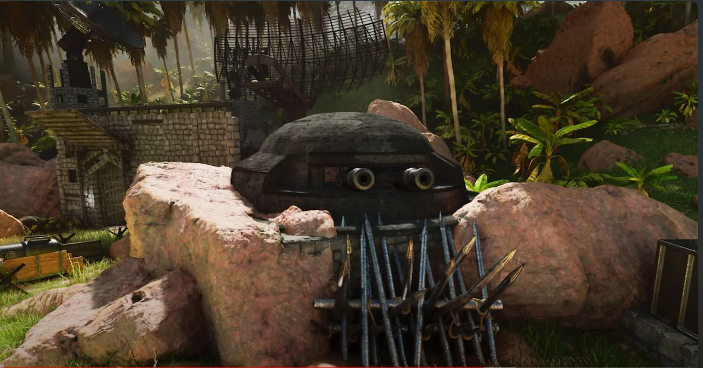
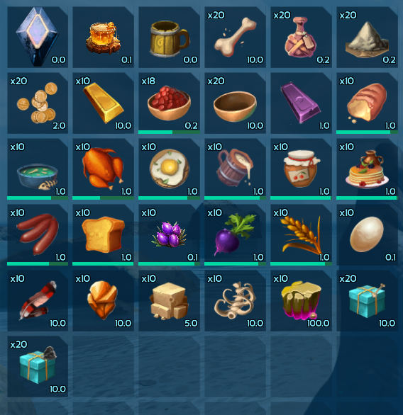

# MuchStuffPack (MSP)

> A large content overhaul for **ARK: Survival Ascended** — **300+ engrams**
> spanning primitive, medieval and post‑apocalyptic themes, with entirely new
> building tiers, hundreds of items, food recipes, resources, furniture,
> crafting stations and reworked gameplay systems.

**Created by Tobias Gellrich (aka *Sloyserg*) — _MSP from Sloyserg Mods_**

---

## 📸 Screenshots

| | |
|:---:|:---:|
|  |  |
| *Medieval watchtower & village* | *Cozy bathhouse interior* |
|  |  |
| *Post‑apocalyptic bunker & defenses* | *A taste of the new items & resources* |

## About

**MuchStuffPack** is meant to be a deep, complex alternative to the famous
*Primitive+* mod from ARK: Survival Evolved. It reworks and expands the game
with hundreds of engrams, new crafting chains and progression — from primitive
tools all the way to post‑apocalyptic, uranium‑grade gear. Expect rich crafting
mechanics, new building styles (transparent glass, rattan, planks), and quality
systems like improved tranq ammunition and an in‑game shopping system via the
shopping tent.

> ⚠️ **Load order:** This mod **must load first**, otherwise things can get
> buggy. (See *Known Issues* on the Discord.)

A full, always‑up‑to‑date list of content lives on the **Discord** — this page
only shows a summary.

## 🔗 Links

| | |
|---|---|
| 🧩 **CurseForge** | https://www.curseforge.com/ark-survival-ascended/mods/muchstuffpack |
| 💬 **Discord (Wiki & update news)** | https://discord.gg/HnEG77J7TM |
| 🎬 **Trailer (YouTube)** | https://www.youtube.com/watch?v=R1RlvfjlLaU |
| ❤️ **Patreon** | https://www.patreon.com/MuchStuffPack |
| 💸 **PayPal (donate)** | https://www.paypal.com/donate/?hosted_button_id=NWQD53YU7CU92 |

## ⬇️ Download

The complete mod content (~10 GB of Unreal Engine assets) is too large to host
directly on GitHub, so the files are provided via Google Drive:

**➡️ Download (Google Drive): `PASTE-YOUR-GOOGLE-DRIVE-LINK-HERE`**

You can also get the mod directly through CurseForge / the in‑game mod browser
using **Mod ID `933785`**.

## ✨ Highlights

- **300+ engrams** — primitive, medieval and post‑apocalyptic content
- **New building tiers** — transparent glass, rattan and planks
- **Shopping system** — buy resource packages for coins at the shopping tent
- **Reworked systems** — e.g. far more effective tranq ammunition
- Deep, *Primitive+*‑style crafting chains

### 🏛️ 150+ new structures

Greater Forge (refine gold & uranium ore) · Bakery Oven (bread from flour &
water) · Meat Grinder · Jewelry Smithy (coins & jewelry from gold) · Shopping
Tent · Old Stove · Garden Bed · Custom Beehive (special flower honey) · Alchemy
Table · Carpenter Table (furniture crafting) · Butter Churn · Wine Barrel ·
Welding Bench (uranium‑grade items) · Uranium Fridge (≈3× a preserving bin,
runs on fuel rods) · Glass Wall · Chungus Storage Box · and more…

### 🛠️ 90+ new craftables

Beer Mug · Bones · Flour · Uranium Ingot · Gold Ingot · Wooden Bowl · Minced
Meat · Gold Coins · Trading Packages · Cooking Oil · Coconut Butter · Cheese ·
Wine & Wine Glass · Fermenting Paste · Fuel Rod · Knowledge Rune · Parchment ·
Writing Ink · Wisdom Potion · Human Plasma · Molten Glass · Antibiotics · and
much more…

### ⛏️ 54+ new resources

Wheat · Animal Spines · Feathers · Gold Ore · Uranium Ore · Sand Stone · Purple
Beet (+ seeds) · Flower Honey · Coconuts · Grapes (+ seeds) · Carbon · …

### 🍳 35+ new food recipes

Toast Bread · Sausage · Fish Soup · Fried Chicken · Fried Egg · Loaf of Bread ·
Grog · Fruit Jam · Pancakes · Ox Tail Stew · Cheese Baked Potato · Wine Filled
Glass · Chicken Kottu · French Croissant · and more…

### 🏹 2 new ammunition types

- **Sleeping Arrow** — nearly twice as effective as the vanilla tranq dart
- **Good Night Arrow** — compound‑bow only; ≈3× as effective as a tranq dart,
  but more expensive

### 🪑 180+ furniture structures

Worn Couch · Basic & Ceramic Flowers · Garden Plant Statue · House Plant ·
Purple Flower · Tropical Plant · Cat Painting · Pup Painting · Big Wooden Table ·
Board Game · and much more…

## 🧰 Requirements & notes

- **Game:** ARK: Survival Ascended (Unreal Engine **5.5**)
- **Mod ID:** `933785`
- **Load order:** must load **first**
- Found a bug? Let me know on the **Discord** — feedback is greatly appreciated!

## 💜 Support

Enjoying the mod? Support is entirely optional — just enjoying the content makes
me happy! If you'd like to chip in, you can donate via
[PayPal](https://www.paypal.com/donate/?hosted_button_id=NWQD53YU7CU92) or
[Patreon](https://www.patreon.com/MuchStuffPack).

## 🙏 Credits

Created by **Tobias Gellrich (aka Sloyserg)**. Thanks to everyone who provided
3D models for the mod (see the CurseForge page / Discord for the full list).

## 📜 License

This work is licensed under a
**[Creative Commons Attribution‑NonCommercial‑ShareAlike 4.0 International License (CC BY‑NC‑SA 4.0)](https://creativecommons.org/licenses/by-nc-sa/4.0/)**.

© 2024 Tobias Gellrich (aka Sloyserg) — *MSP from Sloyserg Mods*

- **BY** — You must give appropriate credit to **Tobias Gellrich aka Sloyserg**.
- **NC** — **Non‑commercial use only.** No use primarily intended for or
  directed toward commercial advantage or monetary compensation.
- **SA** — If you remix or adapt the material, you must distribute your
  contributions under the **same license**.

See the [LICENSE](LICENSE) file for details.

See you on the ARK! 🦖
